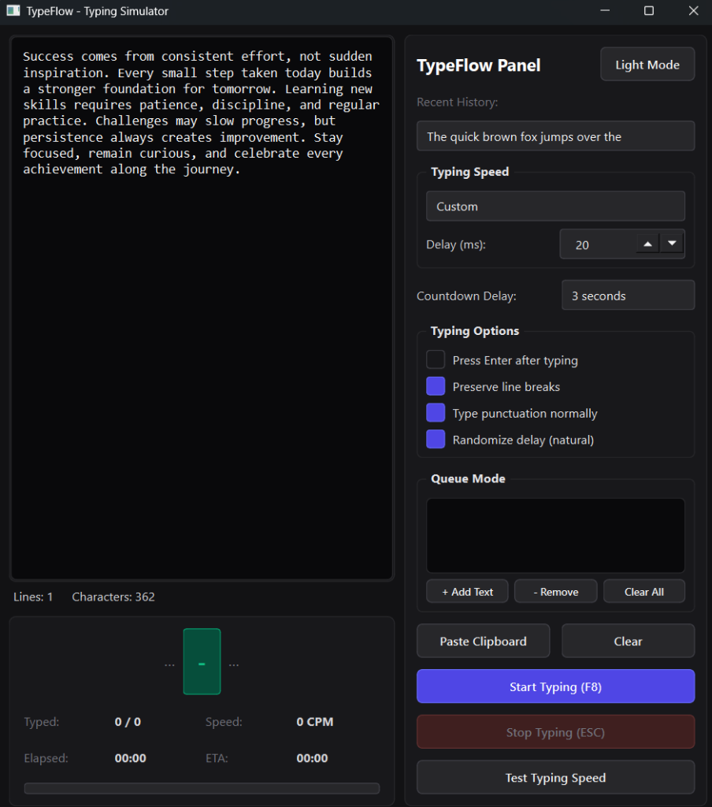

# TypeFlow ⚡

TypeFlow is a professional, high-performance Windows desktop productivity utility designed to simulate normal keyboard input into whichever application window is currently focused. 



Built with a modular Python/PySide6 architecture, TypeFlow is specifically optimized for batch data entry, automated document typing, and high-frequency administrative workflows.

---

## 🌟 Key Features

*   **Simulated Natural Keyboard Input**: Uses Windows `SendInput` APIs via Python `ctypes` to simulate physical typing. It fully supports standard characters, modifiers, symbols, and Unicode. It has a fallback to `pyautogui` for cross-platform resilience.
*   **Focus Protection Overlay**: A translucent, always-on-top countdown screen that prompts you to select and focus the target destination window (e.g., Notepad, a web form, or a custom company database) before simulated input begins.
*   **Queue Mode (Batch Processing)**: Allows you to load multiple pages or text blocks into a queue. Pressing `F8` sequentially launches the countdown and types the next item in the queue.
*   **Live Statistics Dashboard**: Tracks live metrics during typing runs:
    *   *Characters Typed*: Visual indicator (`324 / 541` characters).
    *   *Speed (CPM)*: Average typing speed in Characters Per Minute.
    *   *Timer Metrics*: Live elapsed time and calculated ETA.
    *   *Rolling Character Preview*: Displays previously typed characters, the current character being simulated, and upcoming characters in a rolling ticker view.
*   **Dynamic Global Hotkeys**:
    *   `F8`: Start typing / process next queue item.
    *   `F9`: Pause typing.
    *   `F10`: Resume typing.
    *   `ESC`: Emergency Stop (aborts thread execution instantly).
    *   *Note: Control hotkeys (`F9`, `F10`, `ESC`) are dynamically registered ONLY during active typing to prevent key hijacking in normal desktop use.*
*   **Crash Recovery Checkpoints**: Saves the typing session's state (including cursor progress, text, settings, and remaining queue items) every 50 characters or 2 seconds. Relaunching the app after an interruption automatically offers to restore and resume.
*   **Delay Randomizer**: Adds an optional +/- 25% random delay variance between keystrokes to mimic human typing and satisfy legacy software input buffers.
*   **UI customization**: Elegant theme switching between dark mode (default) and light mode, with automatic window geometry memory.
*   **OCR-Ready Integration**: Includes plugin-ready stub providers inside the directory structure for future OCR expansions (like Tesseract and ChatGPT Vision).

---

## 🛠️ Tech Stack

*   **Core**: Python 3.12+
*   **GUI Interface**: PySide6 (Qt for Python)
*   **Simulation Backend**: PyAutoGUI & ctypes-based Windows `SendInput`
*   **Global Hotkeys**: `keyboard` library
*   **Clipboard Support**: `pyperclip`

---

## 📁 Project Directory Structure

```text
typeflow/
│
├── main.py                     # Application bootstrapper
│
├── core/
│   ├── enums.py                # State, Speed, and Theme definitions
│   └── models.py               # Session, settings, progress, and recovery models
│
├── ui/
│   ├── main_window.py          # Window composition and geometry retention
│   ├── settings_panel.py       # Speed settings, checkboxes, history and Queue sidebar
│   ├── widgets/
│   │   ├── text_editor.py      # Input text editor with live metrics
│   │   ├── progress_card.py    # Typewriter rolling preview, stats grid, and progress bar
│   │   └── status_bar.py       # Bottom status indicator with ASCII progress bar and ETA
│   └── overlays/
│       └── focus_overlay.py    # Click-through countdown screen
│
├── services/
│   ├── controller.py           # Coordinating TypingController state machine
│   ├── typing_backend.py       # Ctypes SendInput / PyAutoGUI key simulation
│   ├── typing_worker.py        # Background QThread typist
│   ├── countdown_worker.py     # Background QThread timer
│   ├── hotkey_service.py       # Thread-safe global key listeners
│   └── ocr/
│       ├── base.py             # Stub OCR provider class
│       └── providers/
│           ├── tesseract.py    # Stub for local OCR extraction
│           └── chatgpt.py      # Stub for GPT Vision API extraction
│
├── utils/
│   ├── settings.py             # Settings configurations storage
│   ├── recovery.py             # Session progress recovery
│   ├── history.py              # Deduplicated input text history list
│   └── constants.py            # Dark/Light CSS stylesheets
│
├── tests/
│   └── test_flow.py            # Unit test suite (persistence, history, math delays)
│
└── requirements.txt            # Package dependencies
```

---

## 🚀 Getting Started

### Prerequisites
*   Windows 10/11
*   Python 3.12 or newer installed

### Setup & Run
1.  Open your terminal (PowerShell or Command Prompt) and navigate to the project directory:
    ```powershell
    d:
    cd d:\Projects\HotTyper\typeflow
    ```
2.  Install dependencies:
    ```powershell
    pip install -r requirements.txt
    ```
3.  Launch the app:
    ```powershell
    python main.py
    ```
4.  Run unit tests to verify:
    ```powershell
    python -m pytest tests/test_flow.py
    ```

---

## 📖 Usage Guide

### Method A: Using Global Hotkeys (Recommended)
This workflow allows you to launch typing without leaving your target application:
1.  Open your target software (e.g. Notepad, Excel, or form software).
2.  In **TypeFlow**, type or paste the text (or click **Test Typing Speed**).
3.  Click inside your target text box so the text cursor (`|`) starts blinking.
4.  Press **`F8`** on your keyboard.
5.  A countdown overlay will appear on screen. Once it hits `0`, TypeFlow will type directly into the focused field.
6.  Press **`F9`** to pause, **`F10`** to resume, or **`ESC`** to instantly abort.

### Method B: Queue Mode (For Batch Processing)
If you have multiple text blocks you need to type sequentially:
1.  Paste the first text block into TypeFlow, then click **`+ Add Text`** in the Queue sidebar.
2.  Paste the next text block, and click **`+ Add Text`** again. Repeat this for all documents.
3.  Click inside your destination window and press **`F8`**.
4.  TypeFlow will load, display, and type the first queue item. Once done, the item is removed.
5.  Focus the next field or page in your database, press **`F8`**, and the app will type the next item in the queue.
